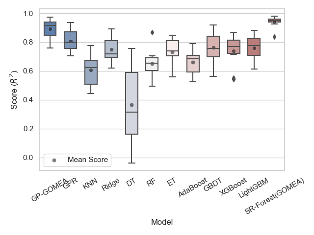

# SR-Forest

SR-Forest is a general framework that supports ensemble learning for SR methods. It applies the following techniques to improve
the predictive performance of an ensemble of SR models:

* Automatic ensemble selection
* Residual learning based on decision trees

## Introduction
Genetic programming (GP) is a population-based ensemble learning framework. Thus, it is intuitive to use all good individuals in the final population to produce an accurate prediction. Even some packages, like "Evolutionary Forest", have been developed for this purpose. These packages are still limited to using a specific kind of symbolic regression algorithm.

To solve this issue, this open-source project intends to propose a general framework for GP-based ensemble-learning. In general, this package focuses on a general technique for improving the performance of GP-based ensemble learning, rather than improving a specific implementation of symbolic regression technique.

## Installation

```bash
pip install git+https://github.com/hengzhe-zhang/SR-Forest.git
```

## Example
An example of usage:
```python
X, y = load_diabetes(return_X_y=True)
x_train, x_test, y_train, y_test = train_test_split(X, y, test_size=0.2, random_state=0)
r = GPGOMEAForest(generations=20, decision_tree=DecisionTreeRegressor(splitter='random'))
r.fit(x_train, y_train)
print(r2_score(y_test, r.predict(x_test)))
```

A comparative example on the "Friedman-1" function:


## Supported Base Learners

More base learners are still in development.

* [Operon](https://github.com/hengzhe-zhang/SR-Forest/blob/master/sr_forest/operon_ensemble.py)
* [GP-GOMEA](https://github.com/hengzhe-zhang/SR-Forest/blob/master/sr_forest/gp_gomea_ensemble.py)

## Citation

```bibtex
@article{EvolutionaryForest,
    title = {An Evolutionary Forest for Regression},
    author = {Zhang, Hengzhe and Zhou, Aimin and Zhang, Hu},
    year = 2022,
    journal = {IEEE Transactions on Evolutionary Computation},
    volume = 26,
    number = 4,
    pages = {735--749},
    doi = {10.1109/TEVC.2021.3136667}
}
```
